# ReClass.NET
This is a port of ReClass to the .NET platform with lots of additional features.

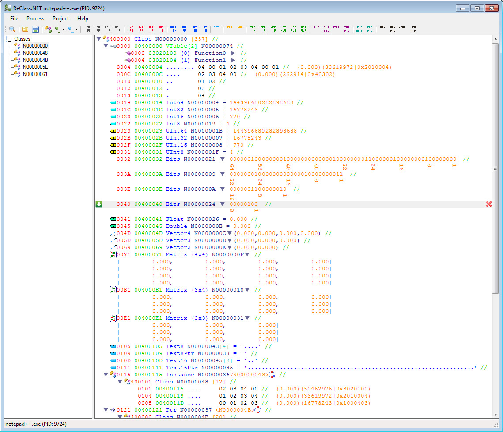

## Changes from upstream

Merged the following pull requests:
- #228: Github action to build latest master push (Completely rewritten now)
- #262: Various Quality of Life features
- #263: Adds Undo/Redo to ReClass.NET
- #270: Implement more sane caret behavior
- #271: Allow loading of uncompressed rcnet file to allow version control tools to work nicely w/ ReClass.NET files

Added the following features:
- Added reclassex project file importing
- Added **{ClassName}** support to the address field (Super ugly implmentation, but I don't want to refactor that much)

The tips section has been expanded with more useful information.

Builds can be download as Action artifacts from [here (Master branch)](https://github.com/piepieonline/ReClass.NET/actions?query=branch%3Amaster).

## Features
- Support for x86 / x64
- File import from ReClass 2007-2016 and ReClass QT
- Memory Nodes
  - Arrays and Pointers to every other node types
  - Hex 8 / 16 / 32 / 64
  - Int 8 / 16 / 32 / 64
  - UInt 8 / 16 / 32 / 64
  - Bool
  - Bits 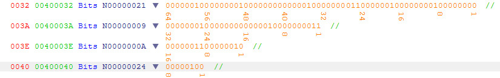
  - Enumerations
  - Float / Double
  - Vector 2 / 3 / 4
  - Matrix 3x3 / 3x4 / 4x4
  - UTF8 / UTF16 / UTF32 Text and pointer to text
  - Virtual Tables
  - Function
  - Function Pointer
  - Unions
- Automatic Node Dissection
- Highlight changed memory
- Pointer Preview
- Copy / Paste Support across ReClass.NET instances
- Display types from Debug Symbols (*.pdb)
- Display Runtime Type Informations (RTTI)
- Control the remote process: start / stop / kill
- Process Selection Dialog with filtering
- Memory Viewer
- Memory Scanner
  - Import files from Cheat Engine and CrySearch
  - Scan for values correlated to your input
- Class address calculator
- Code Generator (C++ / C#)
- Module / Section Dumper
- Linux Support (tested on Ubuntu 18.04)
- Debugger with "Find out what writes/accesses this address" support
- Plugin Support
  - Plugins can be written in different languages (example: C++, C++/CLI, C#)
  - Plugins can provide custom methods to access an other process (example: use a driver)
  - Plugins can interact with the ReClass.NET windows
  - Plugins can provide node infos which will be displayed (example: class informations for Frostbite games)
  - Plugins can implement custom nodes with load/save and code generation support

## Plugins
- [Sample Plugins](https://github.com/ReClassNET/ReClass.NET-SamplePlugin)
- [Frostbite Plugin](https://github.com/ReClassNET/ReClass.NET-FrostbitePlugin)
- [MemoryPipe Plugin](https://github.com/ReClassNET/ReClass.NET-MemoryPipePlugin)
- [LoadBinary Plugin](https://github.com/ReClassNET/ReClass.NET-LoadBinaryPlugin)
- [Handle Abuser Plugin](https://github.com/ReClassNET/ReClass.NET-HandleAbuser)
- Unreal Plugin (not available anymore) (by [DrP3pp3r](https://github.com/DrP3pp3r))
- [DriverReader](https://github.com/niemand-sec/ReClass.NET-DriverReader) (by [Niemand](https://github.com/niemand-sec))

To install a plugin just copy it in the "Plugins" folder.
If you want to develop your own plugin just learn from the code of the [Sample Plugins](https://github.com/ReClassNET/ReClass.NET-SamplePlugin) and [Frostbite Plugin](https://github.com/ReClassNET/ReClass.NET-FrostbitePlugin) repositories. If you have developed a nice plugin, leave me a message and I will add it to the list above.

## Installation
Just download the [latest version](https://github.com/ReClassNET/ReClass.NET/releases) and start the x86 / x64 version or let the launcher decide.

## Tips
- Command line parameters are supported.
  - Pass a project filename to open it
  - `-attachto <process name>` to attach to a process directly.
- Lots of elements have a context menu. Just right-click it and see what you can do there.
- The node window can be controlled with the keyboard too. Arrow keys can select other keys, combined with the shift key the nodes get selected. The menu key opens the context menu which itself can be controlled with the keyboard.
- The memory address field of a class can contain a real formula not just a fixed address.  
  
  **\<Program.exe> + 0x123** will use the base address of Program.exe and add 0x123 to it.
  **{ClassName}** will search for a class with this name in your project and resolve it's address.
  **[0x4012ABDE]** will read the integer (4 byte on x86 / 8 byte on x64) from the address 0x4012ABDE and use this value as class address.
  **[{ClassName} + 0x08]** will resolve the address of the ClassName in your project, add 0x08 and then read the value from this address (Useful to follow pointers from global objects)
  **[\<Program.exe> + 0xDE] - AB** will use the base address of Program.exe, add 0xDE to it, read the value from this address and finally sub 0xAB from it.  
  **[\<Program.exe> + offset + [\<Program.exe> + offset2]]** Nested operations are supported too.  
  
  Valid operations are read ([..]), add (+), sub (-), mul (*) and div (/). Please note that all operations are integer calculations.

## Compiling
If you want to compile ReClass.NET just fork the repository and open the ReClass.NET.sln file with Visual Studio 2019.
Compile the project and copy the dependencies to the output folder.

To compile the linux native core library, you need WSL [installed and configured](https://learn.microsoft.com/en-us/cpp/build/walkthrough-build-debug-wsl2). If you do not need linux support, simply unload the project in the Solution Explorer. If you want to build cross-platform (x86/x64) you have to install `g++-multilib` too.

If you use the `Makefile` with `docker` or `podman` you have to build the needed image `gcc_multilib` from the following `Dockerfile` (`docker build -t gcc_multi .`):

```
FROM ubuntu:latest

RUN apt-get update \
 && apt-get install --assume-yes --no-install-recommends --quiet \
        make \
        g++ \
        g++-multilib \
 && apt-get clean all
```

## Videos

[Youtube Playlist](https://www.youtube.com/playlist?list=PLO246BmtoITanq3ygMCL8_w0eov4D8hjk)

## Screenshots
Process Selection  
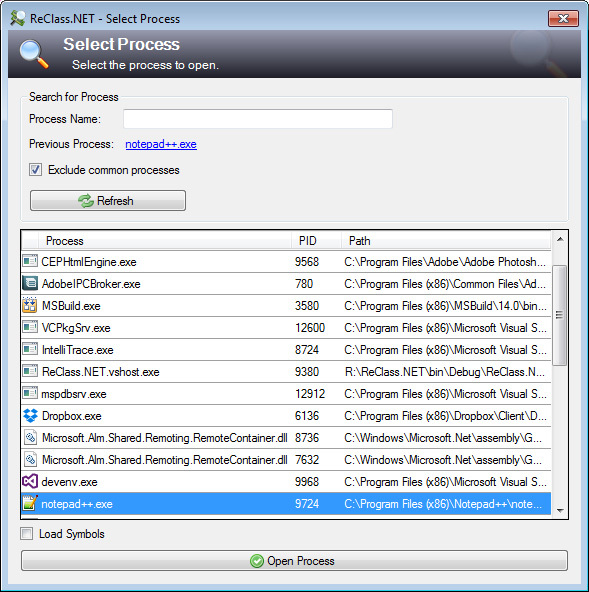

Memory Viewer  
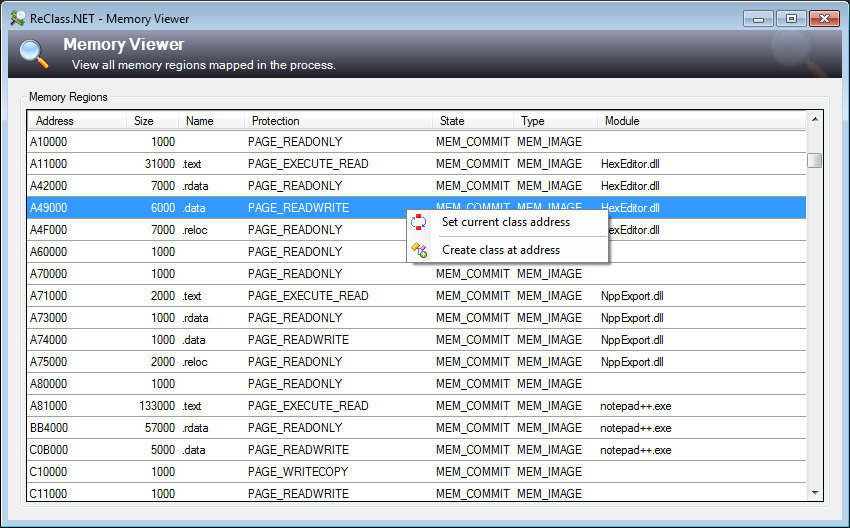

Memory Scanner  
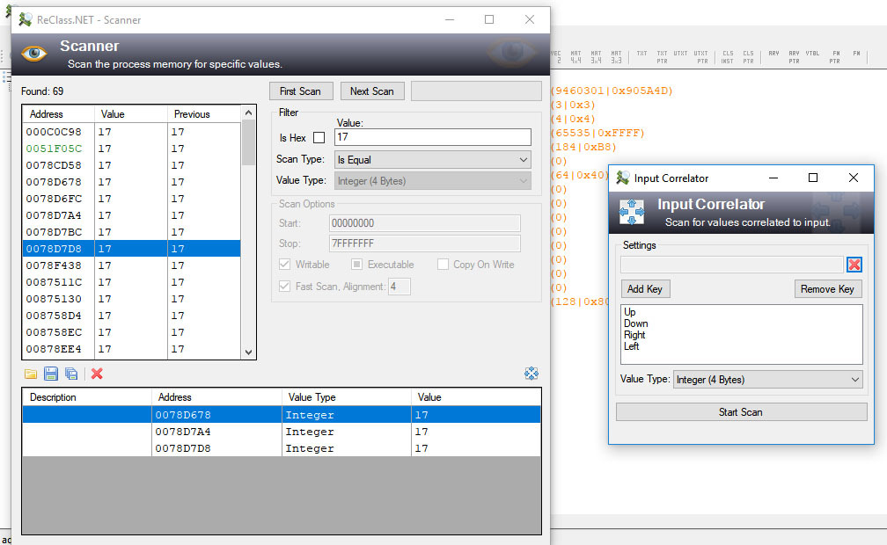

Pointer Preview  
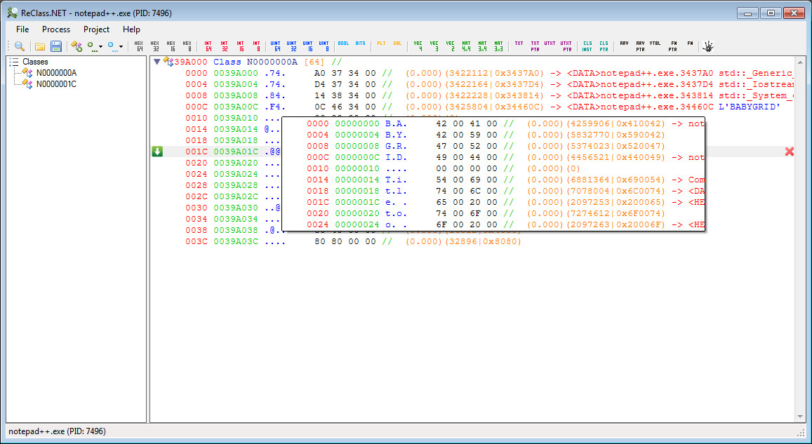

Code Generator  
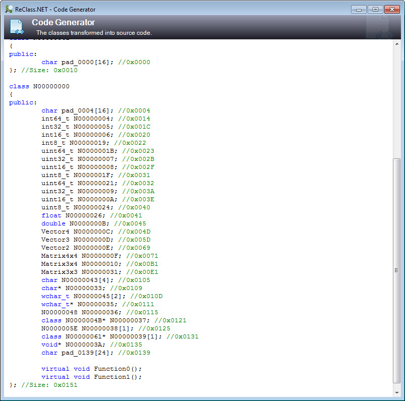  
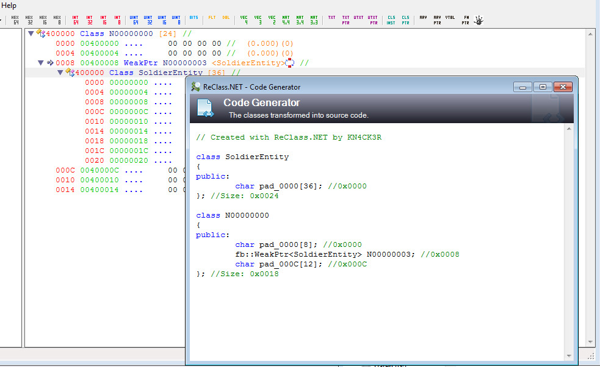

Plugins  
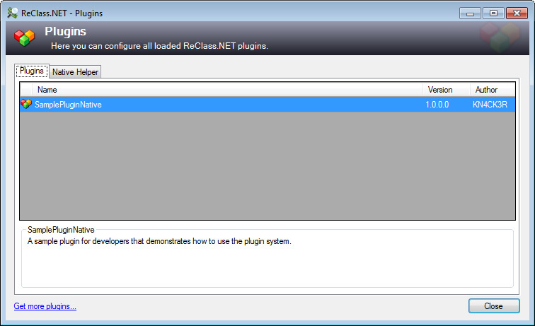  
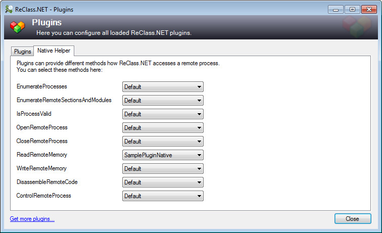

Settings  
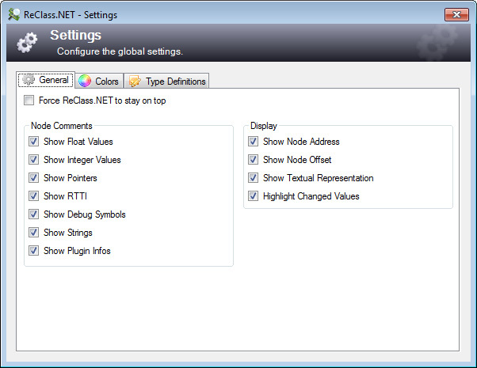

## Authors / Special Thanks
- [KN4CK3R](https://github.com/KN4CK3R)
- DrUnKeN ChEeTaH
- P47R!CK
- DogMatt
- [ajkhoury](https://github.com/ajkhoury)
- [IChooseYou](https://github.com/IChooseYou)
- [stevemk14ebr](https://github.com/stevemk14ebr)
- [Timboy67678](https://github.com/Timboy67678)
- [DarthTon](https://github.com/DarthTon)
- [ReUnioN](https://github.com/ReUnioN)
- leveln
- [buddyfavors](https://github.com/buddyfavors)
- [DrP3pp3r](https://github.com/DrP3pp3r)
- [ko1N](https://github.com/ko1N)
- [Niemand](https://github.com/niemand-sec) (see his talk at [BlackHat Europe 2019 (London) "Unveiling the underground world of Anti-Cheats"](https://www.blackhat.com/eu-19/briefings/schedule/index.html#unveiling-the-underground-world-of-anti-cheats-17358))